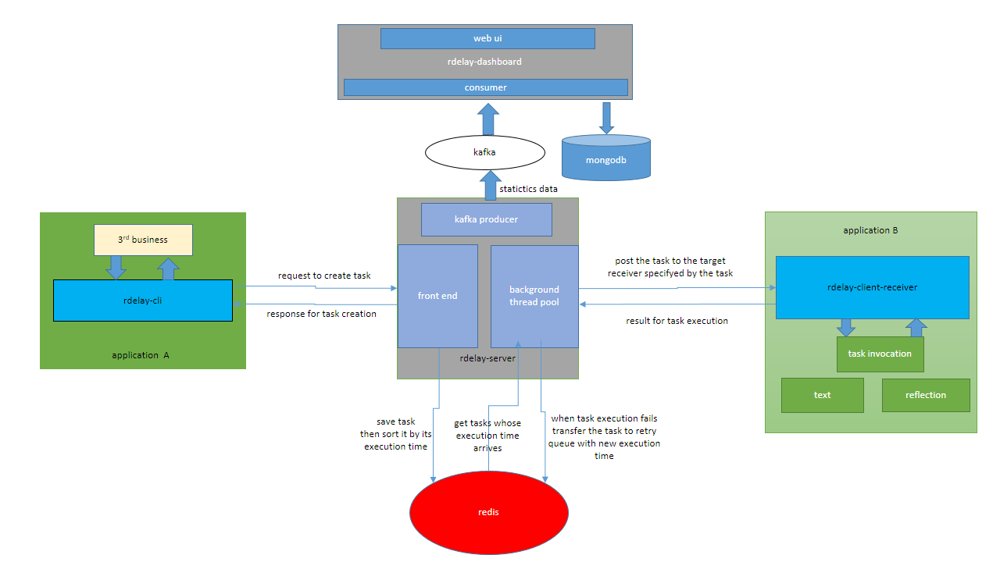

# rdelay
a redis-based lightweight distributable timing framework powered by spring boot as personal experimental work

### Theory
Use redis ZSET to maintain taskIds which are ordered by their execution time asc,get the tasks whose execution time is 
reached by now and then send them back to the url specified by each task respectively.It supports retry mechanism.


### Attention
The framework is now very primitive,there is much work ahead.Use it at your own risk.


### Rough structure



### Usage (StrContentTask)

#### sender
```java
public class SenderExample {
    public static void main(String[] args) throws Exception {
        // designate the rdelay server address where the task to be sent
        TaskSender.setDestSvrAddr("http://127.0.0.1:8086");

      //  while (true) {
            Req4CreateStrContentTask req4CreateStrContentTask = new Req4CreateStrContentTask();

            req4CreateStrContentTask.bizTag = "testBizTag";
            // run after 10s
            req4CreateStrContentTask.executionTime = System.currentTimeMillis() + 2000;
            req4CreateStrContentTask.executionAppSvrAddr = "http://127.0.0.1:8080";
            req4CreateStrContentTask.content = "testContent";

            Resp4CreateTask resp4CreateTask = TaskSender.sendTask(req4CreateStrContentTask);

            System.out.println(resp4CreateTask.success + "_" + resp4CreateTask.errMsg);

          //  Thread.sleep(60000000);
      //  }
    }
}
```

#### receiver
```java
// add the package "com.fenquen.rdelay.client.receiver" to the scanning range,the server is listening 127.0.0.1:8080
@SpringBootApplication(scanBasePackages = {"com.fenquen.rdealy.example.client.receiver", "com.fenquen.rdelay.client.receiver"})
public class BootstrapClientReceiver {
    public static void main(String[] args) {
        SpringApplication.run(BootstrapClientReceiver.class, args);

    }
}
```
###### alternative Implements the Interface "StrContentTaskConsumer" to process StrContentTask
```java
@Component
public class TaskConsumer implements StrContentTaskConsumer {
    @Override
    public void consumeTask(StrContentTask strContentTask) {
        System.out.println(strContentTask.content);
    }
}
```